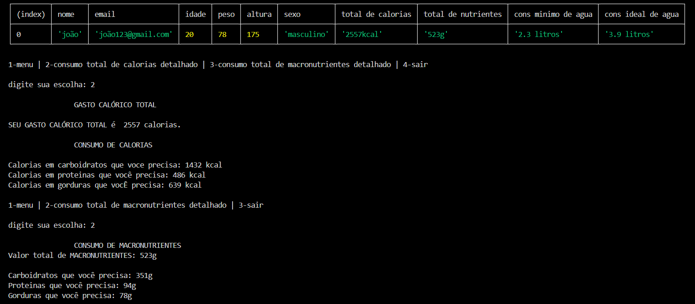

# Calculadora-Fitness---Treinando-linguagens-de-programação-Node.js-e-SQL
Programa que calcula as calorias, macronutrientes e consumo de água do usuário. Esse pequeno projeto serve para treinar o uso das linguagens Node.js e SQL.
Codigos feitos nos programas Visual Studio Code e MySQL Workbench 8.0 CE

